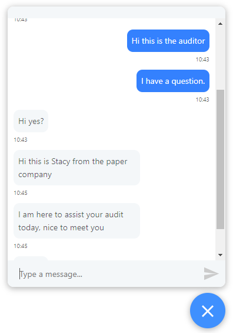

# Docusign FSC Hackathon UI

## Overview
This is the UI for our App3 project. When the user logs in, they enter a certification session which is a guided walk through through the certification process.

The system supports multiple user roles (Applicant, CB, FSC, ASI). Each roles is given a different walk through experience which is tailored based on their needs and 
permissioning.

Data is communicated and persisted by through the backend REST API server

## Features and Technologies Used

### Authentication and Authorization
Users are logged in by by exchanging their credentials for a JWT token from the backend
server. This JWT token is signed by an asymmetric key and encodes information just as the
users email and role.

```
{
  "user": {
    "id": "5f48737f8968a481770ab4df",
    "email": "cb@cb.org",
    "name": "Tom",
    "role": "CB"
  },
  "iat": 1598755434,
  "exp": 1630291434
}
```

The token is decoded to facilitate Role Based Access Control
  - Applicant Role
    - Allowed to sign initial certificate
    - Not allowed to view evaluations
    - Not allowed to sign final certificate
  - Certification Board Role
    - Allowed to view and add evaluations
    - Allowed to sign final certificate
    - Not allowed to sign initial certificate
  - FSC and ASI roles
    - Not allowed to sign initial certificate
    - Allowed to view evaluations
    - Not allowed to add evaluations
    - Not allowed to sign final cert

### Docusign OAuth2
OAuth2 is used to make request to Docusign on behalf of a user. This is used to generate
certificate to sign with the appropriate recipients. 

OAuth code and token exchange is facilitated by proxying requests through the backend
server. When the token is received by the frontend, it is saved in the browser's local
storage and refreshed when it's expired

### Google Drive Integration
A google drive folder is used to upload evidences and observations which are then
evaluated by the Certification Board. This folder is embedded and integration in the UI's
observation step

### Evaluations
Evaluations allow the Certification Board to comment on observations. This data is
persisted in Dynamics' evaluation schema. Every evaluation has a date, subject
(observation) and related certificate that the observation is part of.

CRUD operations on the evaluations schema are proxied through the backend application via
a RESTful interface.


### Live Chat
The live chat allows different parties to communicate with each other in a unified chat
interface. This allows conversations to be scoped to the certificate thats in progress

This is implemented using long polling which is the what allows the real time chat to 
take place. Periodically the UI polls the backend to check if any new messages are
available. If there are, this is then rendered in the UI. The chat component is aware
if the message was send by the current user or by a different and uses this information
to visually distinguish different messages.




## Further Improvements
This a lot of areas that this PoC can be improved on

 - We'd like to implement a more seamless integration with google drive which allows
 users to drag and drop files and add evaluations in the form of annotations directly in the file view
 
 - Since there are multiple actors in this certification process, use of notifications 
 in the form of in app notification and emails would help complete the process faster

